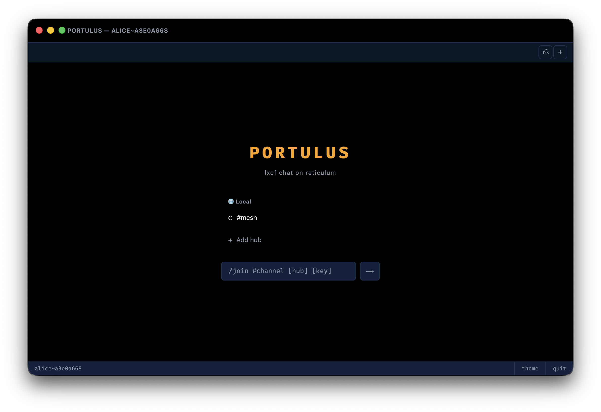
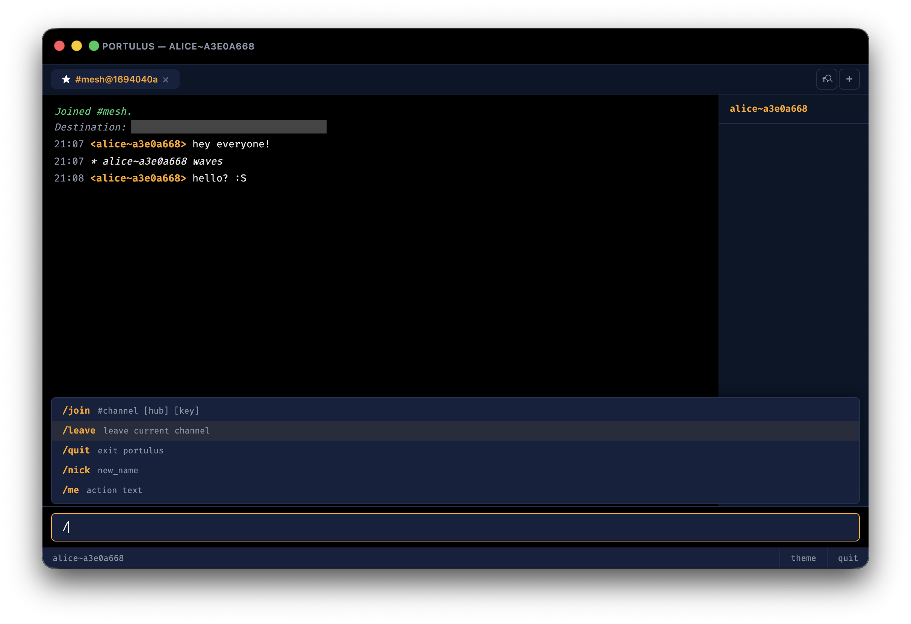

# Portulus

A desktop chat client for [LXCF](https://github.com/kageedwards/lxcf) over [Reticulum](https://reticulum.network) mesh networks. Built with Electron and a Python LXCF bridge.





## Install

```bash
git clone https://github.com/kageedwards/portulus
cd portulus
npm install
npm start
```

Requires Node.js ≥ 18 and Python ≥ 3.10

## Features

- Multi-channel tabbed interface with bookmarks
- Public and symmetrically keyed channels (both E2EE)
- Nickname changes, /me emotes
- Member sidebar with identity suffixes
- Seven themes: 
  midnight, cherry blossom, vintage charm, mocha latte, halcyon skies, legion, millennium
- IRC command autocomplete (`/join`, `/leave`, `/nick`, `/me`, `/quit`)
- Shares a common config format and default config location with the TUI client
- Reads `~/.reticulum/config` for TCP interfaces automatically
- Local rnsd support on `127.0.0.1:37428`

## Configuration

Portulus uses two config sources:

### Shared config
INI format, shared with the TUI client.

`~/.lxcf/config`:
```ini
[lxcf]
nick = yourname
announce_joins = True
use_local_rnsd = True
```

### Portulus-specific settings

`~/.lxcf/portulus.json`:
```json
{
  "theme": "midnight",
  "interfaces": [
    { "name": "RMAP", "host": "rmap.world", "port": 4242 }
  ]
}
```

The `interfaces` list is a fallback — if `~/.reticulum/config` has enabled `TCPClientInterface` entries, those are used instead. This may be removed in the future to alleviate redundancy.

### Bookmarks
Shared bookmark list. Toggle with `Ctrl+S` or click the star on a channel tab.

`~/.lxcf/bookmarks.json`:
```json
{
  "hubs" : {
    "My Hub": {
      "destination": "asd8a9sd8as0d9a8s90dasdas09dadsa",
      "channels": [
        {"name": "#lobby"}
      ]
    }
  }
}
```

## Commands

| Command | Description |
|---|---|
| `/join #channel [hub] [key]` | Join a channel on a hub optionally with an encryption key (will end up generating a different #channel) |
| `/leave` | Leave the active channel |
| `/nick name` | Change your display name |
| `/me action` | Send an emote-style message |
| `/quit` | Leave all channels and exit |

## Keyboard Shortcuts

| Key | Action |
|---|---|
| `Ctrl+S` | Toggle bookmark on active channel |
| `Escape` | Dismiss modals and menus |
| `Tab` / `Enter` | Accept command autocomplete |

## CLI Options

```bash
npm start -- --rns-config /path/to/reticulum/config
```
This app works best with default config and a running Reticulum shared instance.

## Dependencies

- [LXCF](https://github.com/kageedwards/lxcf) — Python protocol library (via bridge subprocess)
- [Electron](https://www.electronjs.org/)

## License

MIT
